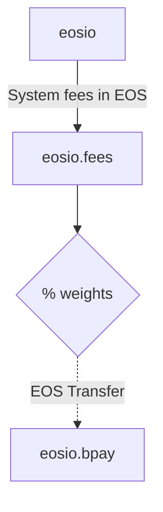

# EOS Fees (`eosio.fees`) [](https://github.com/eosnetworkfoundation/eosio.fees/actions/workflows/test.yml)

## Overview

The `eosio.fees` contract handles system fee distribution.



## Strategies

The `eosio.fees` contract is designed to distribute fees from any outstanding EOS balance to a set of strategies. Each strategy is responsible for distributing the fees to a specific pool or contract based on a predefined logic. Each strategy has an associated weight which determines the percentage of fees that will be distributed to that strategy.

| Strategy      | Description |
| ------------- | ----------- |
| `donatetorex` | Donate to REX - Distributes fees to REX pool which is distributed to REX holders over a 30 day period |
| `buyramburn`  | Buy RAM & Burn - Locks up additional EOS in RAM pool while reducing the total circulating supply of RAM
| `buyramself`  | Buy RAM Self - Accumulates RAM bytes within the `eosio.fees` account
| `eosio.bpay`  | Block Producer Pay - Sends EOS to `eosio.bpay` contract for distribution to block producers

## Development and Testing

### Build Instructions

To compile the contract, developers can use the following command:

```sh
$ cdt-cpp eosio.fees.cpp -I ./include
```

### Testing Framework

The contract includes a comprehensive testing suite designed to validate its functionality. The tests are executed using the following commands:

```sh
$ npm test

> test
> bun test
```

#### Exported memory errors

```
TypeError: undefined is not an object (evaluating 'this.memory.buffer')
```

If you're using a version of CDT to build that doesn't support exported memory, you'll need to export it manually for VeRT tests to work.

```bash
# Grab wabt
sudo apt-get install wabt

# Create a temporary wat file and export the memory
wasm2wat eosio.fees.wasm | sed -e 's|(memory |(memory (export "memory") |' > eosio.fees.wat
wat2wasm -o eosio.fees.wasm eosio.fees.wat
rm eosio.fees.wat
```

You can also use the `./build.sh` script that will handle building and exporting memory for you.